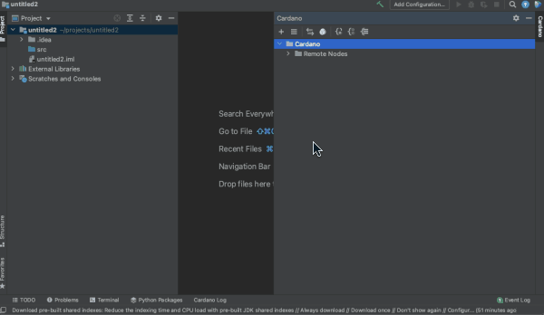
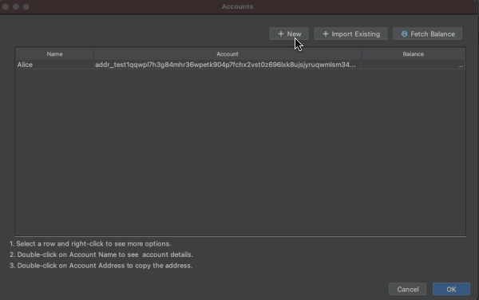
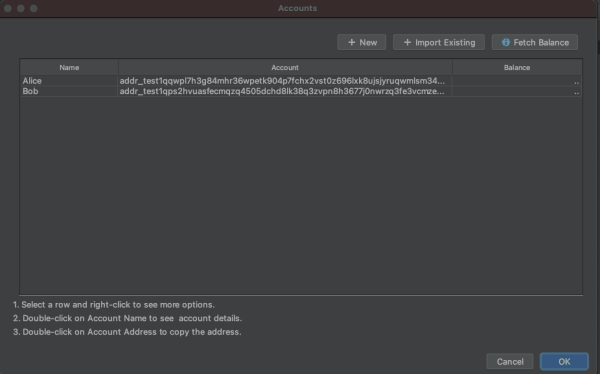
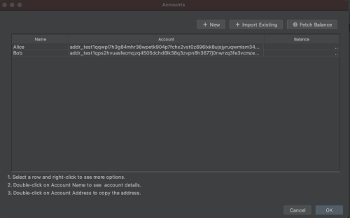
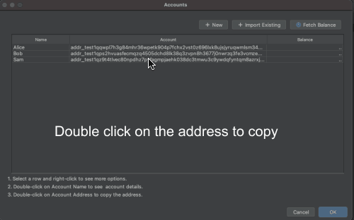

# Account Management

The following account management features are currently supported

* Create a mainnet/testnet account
* Import an account from 24w mnemonic phrase
* Import an account as "read-only" \(watch-only\)
* List all accounts
* Fetch balance of all accounts
* Get account details \( Ada / Native token balance, recent transactions, utxos\)

### Open Account Management UI

* Click on "List Accounts" icon in Cardano Tool Window.

### Create a new account

* In "Account Management" dialog, click the "New"
* Enter a name for the account
* Select testnet / mainnet
* Click "Ok"

###  Fetch Balance

The account management screen shows all the created or imported accounts. You can also fetch balances of all the accounts by clicking the "Fetch Balance" button.

Based on the configured default node, balance for testnet or mainnet accounts are fetched.

### Import an existing account

In account management ui,

* Click "Import Existing"
* Select the network \(testnet/mainnet\)
* Enter 24w mnemonic phrase
* Click "Ok"

**Note:** An external account can also be imported as a "read-only" account. In that case, you just need to provide the address.  
  

### Copy Address

* Double click on the address column to copy the address
* Alternatively, select the row, right click -&gt; Copy Address

### Account Details

* Double click on the account name to open "Account Details" UI for the address
* Account details UI shows Ada balance and native token balances.
* The bottom panel in "Account details" UI shows recent transactions for the address.
* Select a transaction hash and double-click to see the transaction and metadata details.
* Click on "Show Utxos" to see the available utxos for the address.



