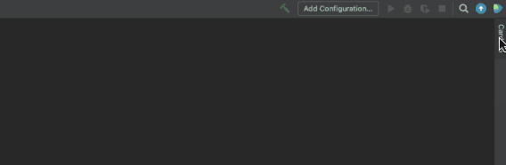
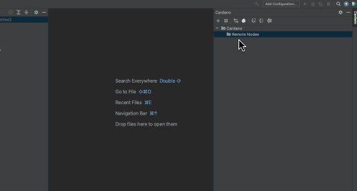
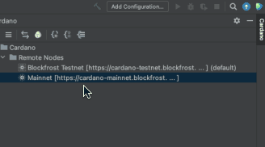

# Cardano Node Configuration

Currently you can only configure [Blockfrost](https://blockfrost.io/) node inside the IDE. Blockfrost provides api endpoints for both Cardano Mainnet and Testnet. Once configured, you can use the configured node to interact with the Cardano blockchain.

**Note:** Support for other node types will be added in the future release. \(e.g; Cardano wallet, Cardano GraphQL ...\)

### **Pre**-**requisites**

You need to first register on Blockfrost website \([https://blockfrost.io](https://blockfrost.io)\) to get a "Api Key" or "Project Id". Once you get the api key for mainnet or testnet, you are ready to configure a Blockfrost node in the IDE.

### Configure a new node

* Create an empty project. Type of project doesn't matter if you just want to interact with Cardano.
* Once the project is opened, you should be able to see "Cardano" tab in the right side tool window.

* Enter name, select Blockfrost node type \(Testnet or Mainnet\)
* Enter Blockfrost "Api Key" in the "Project Id" text field.
* Click "Test Connectioin" to verify the connection.
* Then click ok to create a new node configuration.

### Select a default node

If you have multiple nodes configured in the IDE, you need to set a node as default node. IDE connects to the default node to submit the transactions, query blockchain data or other supported operations.

