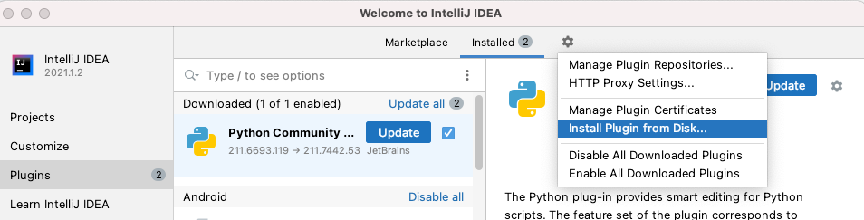
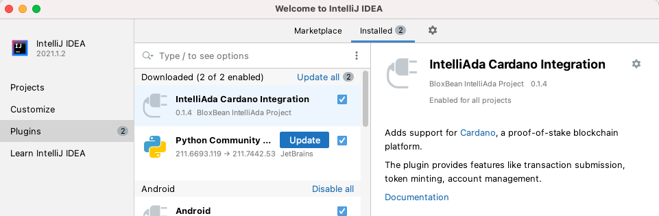

# Installation - Manual

### Download Plugin Binary

Download IntelliAda plugin binary from GitHub



### **Supported IntelliJ version  \(2021.1 and above\)**

* IntelliJ IDEA
* PyCharm
* GoLand
* WebStorm
* PhpStorm

### Installation

* Start IntelliJ IDE
* Go to Plugin window \(Preferences -&gt; Plugins or File -&gt; Settings -&gt; Plugins based on your Operating System\)
* Select "Install Plugin from Disk..."

* Select the plugin zip file  
* Click "Restart IDE" to restart and install the plugin

