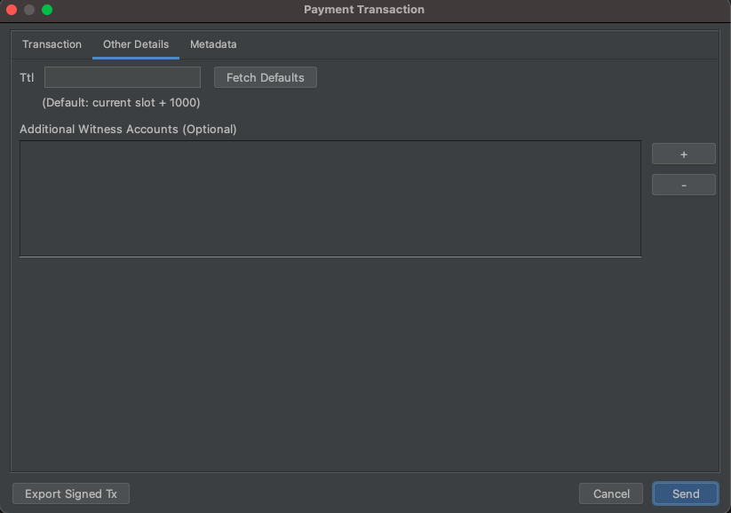

# Transaction Details \(Other Details Tab\)

You can provide additional details about a transaction in "Other Details" tab in both Transfer & Token Minting UI.

Currently, you can provide "Ttl" and "Additional Witness Accounts".

