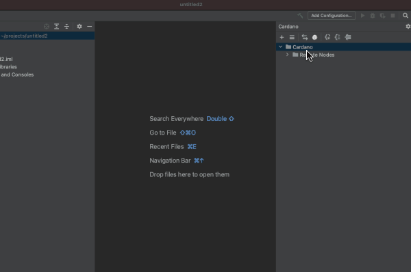

# Transfer Transaction

You can use "Transfer" UI to transfer Ada or any native tokens from one address to another. You don't need to manually select utxos during the transfer. The plugin automatically selects enough utxos for the transaction. But if you want to include specific utxos in the transaction, you can do so using Utxo selector UI.

### Open Transfer Transaction UI

### Transfer Ada / Native Token 

1. Click on account chooser button \(...\) to select sender account. You can also provide mnemonic if sender is an external account.
2. The available balance \(both Ada & other native tokens\)  for the address is fetched.
3. Select Ada or an available native token
4. Select a receiver
5. Enter amount
6. \(Optional\) Click on "Calculate Fee" to calculate the fee. This is an optional step.
7. \(Optional\) You can also override the fee if you want. But leaving it blank should work.
8. Click "Send"



### 

### Select specific Utxos during transfer

* Select sender, token type, receiver and amount as shown in the previous section.
* Select the checkbox "Select to provide utxos for the transaction"
* Click "Add" to open Utxo selector.
* Utxo selector UI shows the utxos specific to the sender address. \(Max 1000 recent utxos are shown\)
* Select enough utxos to cover your transaction amount and click ok
* Click "Send" to submit the transaction



